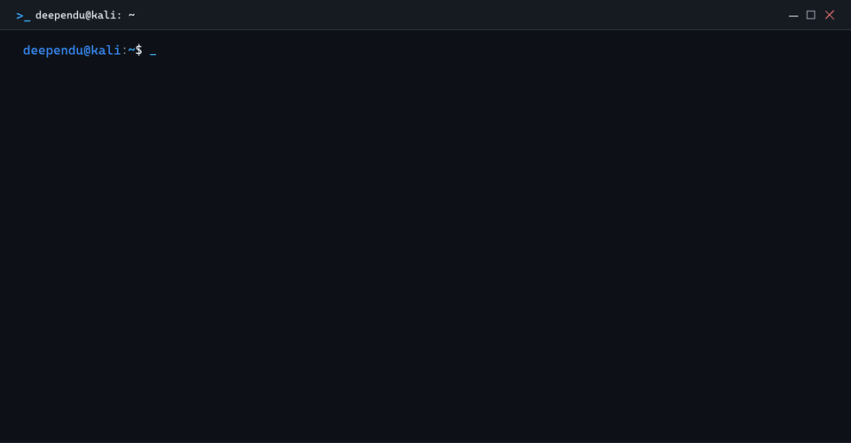

<h1 align="left">
  
</h1>

Cybersecurity enthusiast focused on **Offensive Security**, **Application Security**, **Security Research**, and **Security Tooling**.

I enjoy understanding how software and infrastructure fail, building tools around those weaknesses, and turning security research into practical engineering.

---

## 🧭 WHAT I DO

* 🔴 **Offensive Security** — Active reconnaissance, attack surface discovery, parameter fuzzing, and controlled exploit validation.
* 🟣 **Application Security** — Automated OWASP Top 10 auditing, AST parsing, and broken object-level authorization (BOLA) detection.
* 🔵 **Security Research** — Dissecting system invariants, analyzing client isolation sandboxes, and reproducing vulnerabilities.
* 🟢 **Security Tooling** — Engineering deterministic security CLIs, heuristic scanning engines, and structured telemetry reporters.
* 🟠 **Threat Intelligence** — Automated indicator ingestion, behavioral scoring algorithms, and MITRE ATT&CK telemetry correlation.

---

## 🌐 CONNECT

  
  
  
  
  

---

## ⚡ TECHNICAL ARSENAL

### 🛡️ Security

### 💻 Development & Tooling

### 🌐 Networking & Protocols

### 🐧 Systems & Runtimes

### 🧪 Testing & Verification

---

## 🔭 CURRENTLY EXPLORING

* 🔍 **Web & API Security** — Advanced authorization fuzzing, BOLA/IDOR edge patterns, and GraphQL security auditing.
* ⚔️ **Offensive Security** — Privilege escalation paths, Linux internal misconfigurations, and active network exploitation.
* 🧪 **Vulnerability Research** — Analyzing client isolation sandboxes, heuristic classification bypasses, and DOM security.
* 🤖 **Security Automation** — Building autonomous scanning pipelines and verifiable detection harnesses.
* 🛰️ **Threat Intelligence** — Real-time IOC enrichment pipelines and MITRE ATT&CK behavioral telemetry mapping.

---

## 🚀 FEATURED WORK

* **[PhishingGuard](https://github.com/Deependu001/PhishingGuard)**  
  Client-side runtime phishing detection and input isolation engine operating locally in the browser sandbox without third-party telemetry egress.  
  `JavaScript` · `Manifest V3` · `Shadow DOM` · `Heuristic Engine`

---

## 📈 GITHUB CONTRIBUTIONS

  

---

## 📊 GITHUB ACTIVITY

  

   
  <em>Always learning. Always testing. Always building.</em>
    
  <code>DEEPENDU MONDAL · OFFENSIVE SECURITY &amp; SECURITY TOOLING ARCHITECTURE · INDIA</code>

